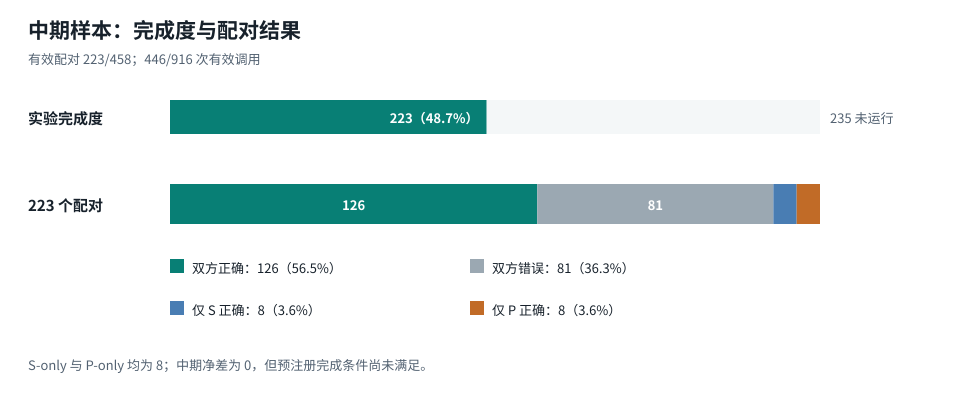
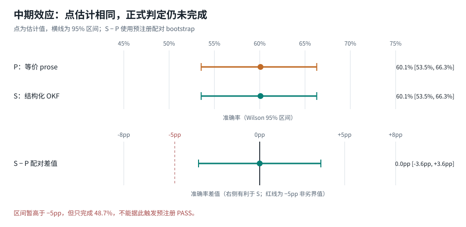
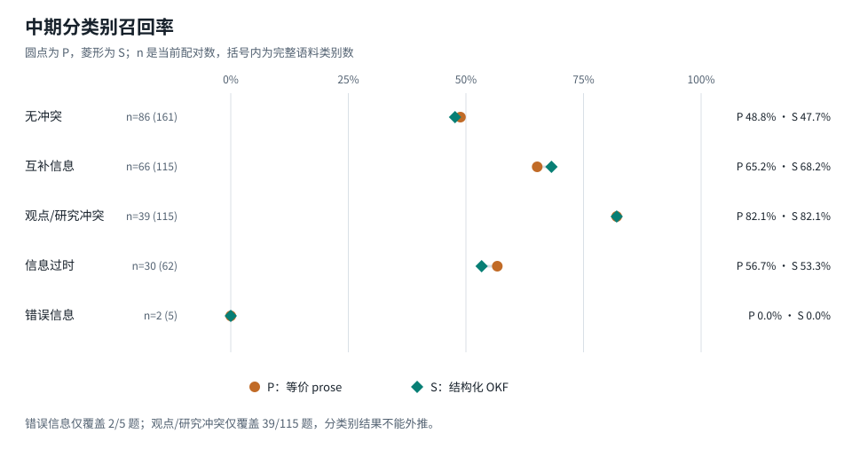

# OKF v0.2 × CONFLICTS 中期实验报告

> - 状态：**INCOMPLETE — 不作正式非劣效判定**
> - 数据截点：2026-09-13 07:06:26 UTC
> - 完成度：223 / 458 个配对（48.7%），446 / 916 次有效调用

## 摘要

本轮实验比较两种语义等价的来源元数据表达：

- `P`：把来源 ID、URL、标题和日期写成带标签的自然语言段落；
- `S`：把完全相同的字段写入结构化 OKF frontmatter。

在当前 223 个已完成配对上，`P` 与 `S` 都答对 134 题，accuracy 均为 60.1%。配对差值
`S − P` 为 `0.0pp`，固定种子的 100,000 次 item-level bootstrap 95% 区间为
`[-3.6pp, +3.6pp]`。126 题双方均正确，81 题双方均错误，`S-only` 与 `P-only` 各 8
题；McNemar 精确双侧检验 `p = 1.0`。

这些数据说明：**在已经运行的题目上，没有观察到结构化 OKF 相对等价 prose 的方向性优势或
明显退化。** 但这不是“已经证明等价”或“已经证明非劣”。预注册要求 458 个完整配对，本次只完成
48.7%；而且停止点对应执行顺序的前缀，不是预先设计的随机或分层中期样本。正式决策必须保持
`INCOMPLETE`。

另有一项重要审计限制：逐条 JSONL 原始结果原本位于可清理的临时 worktree，任务中断后该目录被
系统清理。中断前保留了 analyzer 输出、配对计数、分层计数、运行元数据和原始文件 SHA-256，但当前
机器上已经无法逐条复算或重新评分。因此本报告是**可从冻结汇总值重绘的中期观察**，证据等级为 C，
不能升级为预注册 B 级证据。

## 1. 研究问题与预注册判据

实验问题不是“增加来源信息是否有用”，而是更窄的表示问题：在正文证据、问题、文档顺序、来源事实、
输出 schema 和模型均相同的条件下，把同一份 metadata 写成结构化 OKF，是否会损害冲突分类正确率？

主 estimand 为：

```text
Δ = accuracy(S) − accuracy(P)
```

冻结的非劣界值为 `−5pp`：只有在 458 个配对全部完成，且配对 bootstrap 95% 区间下界严格高于
`−5pp` 时，才判定 `PASS`。协议与机器可读合同见
[PREREGISTRATION.md](../benchmarks/okf-delta/PREREGISTRATION.md) 和
[fair-conflicts-v1.json](../benchmarks/okf-delta/preregistration/fair-conflicts-v1.json)。

## 2. 数据完整性



| 项目 | 数量 | 说明 |
| --- | ---: | --- |
| 计划题目 | 458 | 锁定的 CONFLICTS 完整 split |
| 已完成配对 | 223 | 每题同时具有有效 `P` 与 `S` 结果 |
| 有效调用 | 446 | 进入当前描述统计的 latest attempts |
| 实际记录 attempts | 448 | 包含 2 条基础设施失败记录 |
| 成功重试 | 2 | 原始失败保留，`attempt=1` 覆盖进入分析 |
| 当前有效 invalid | 0 | 限流失败未作为模型错误计分 |

停止前验证结果显示，所有有效记录使用同一 benchmark revision、同一模型、同一预注册哈希和同一代码
提交；同一 item 的两臂文档顺序相同。运行在达到额度边界时停止，而不是依据模型成绩停止，但当前 223
题仍只是数据文件执行顺序的前缀，不能假定为完整语料的概率样本。

## 3. 主结果



| 指标 | P：等价 prose | S：结构化 OKF | S − P |
| --- | ---: | ---: | ---: |
| 正确数 / n | 134 / 223 | 134 / 223 | 0 |
| Accuracy | 60.1% | 60.1% | 0.0pp |
| Accuracy Wilson 95% CI | [53.5%, 66.3%] | [53.5%, 66.3%] | — |
| Macro-F1 | 49.2% | 48.9% | −0.3pp |
| 配对 bootstrap 95% CI | — | — | [−3.6pp, +3.6pp] |

配对四格为：

| P | S | 题数 | 占 223 题 |
| --- | --- | ---: | ---: |
| 正确 | 正确 | 126 | 56.5% |
| 错误 | 错误 | 81 | 36.3% |
| 错误 | 正确 | 8 | 3.6% |
| 正确 | 错误 | 8 | 3.6% |

`S-only = P-only = 8`，所以配对点估计恰为零，McNemar 精确双侧 `p = 1.0`。这表示当前样本没有
方向性差异证据；它不表示两种表示在任意任务、模型或完整语料上相同。

当前区间下界 `−3.6pp` 虽高于冻结界值 `−5pp`，但预注册的 completeness gate 优先：只有完整
458 个配对才允许作主判定。中途把这个区间解释成 `PASS` 会构成未预注册的提前停止。

## 4. 分类别结果与停止前缀偏差



| Gold label | 当前 n / 全量 n | 覆盖率 | P recall | S recall | S − P |
| --- | ---: | ---: | ---: | ---: | ---: |
| No conflict | 86 / 161 | 53.4% | 48.8% | 47.7% | −1.2pp |
| Complementary information | 66 / 115 | 57.4% | 65.2% | 68.2% | +3.0pp |
| Conflicting opinions and research outcomes | 39 / 115 | 33.9% | 82.1% | 82.1% | 0.0pp |
| Conflict due to outdated information | 30 / 62 | 48.4% | 56.7% | 53.3% | −3.3pp |
| Conflict due to misinformation | 2 / 5 | 40.0% | 0.0% | 0.0% | 0.0pp |

类别覆盖明显不均：互补信息已覆盖 57.4%，观点/研究冲突只覆盖 33.9%。尤其是错误信息类只有 2
题，`0%` 没有稳定解释。Macro-F1 也会被这一极小类别及未完成类别构成强烈影响。因此分类别结果只
用于定位可能的误差方向，不能作为完整 CONFLICTS 分布的估计。

## 5. 输入成本与运行时间

| 指标 | P | S | S 相对 P |
| --- | ---: | ---: | ---: |
| 平均 prompt 字符数 | 17,414.5 | 17,202.4 | −1.2% |
| 平均调用延迟 | 16.54 s | 16.65 s | +0.7% |
| 延迟中位数 | 16.29 s | 15.81 s | −2.9% |
| 延迟 p95 | 24.20 s | 25.55 s | +5.6% |

结构化组在当前样本里平均少约 212 个字符，但延迟均值几乎相同。延迟来自并发 2 的真实运行，受网络、
服务负载与额度边界影响，没有为性能推断做随机化或阻塞控制；因此只能作为工程描述，不能解释为
OKF 结构化编码导致的速度变化。runner 未能从当前 CLI 通道获得 tokenizer 的精确 input token 数，
字符数也不能替代计费 token。

## 6. 可以与不可以得出的结论

当前数据支持以下有限陈述：

1. 在已完成的 223 题上，结构化 OKF 没有出现明显整体崩溃，accuracy 与等价 prose 相同；
2. 两臂分歧很少且方向对称：16 / 223 题分歧，两个方向各 8 题；
3. 表示层实验管线可以保持正文、metadata 语义和文档顺序一致，并能审计基础设施重试；
4. 结构化表示在这部分样本中略短，但没有稳定延迟优势。

当前数据**不支持**以下陈述：

1. “结构化 OKF 已被证明不劣于 prose”；
2. “OKF v0.2 能提高模型准确率”或“二者已经等价”；
3. “类别召回率差异可以推广到完整 CONFLICTS”；
4. “本次结果可独立逐条复现”——原始 JSONL 已丢失，只有汇总与校验和保留；
5. “该实验验证了完整 v0.2”——本操纵只比较来源 metadata 的表示，并未验证 trust、verification、
   lifecycle、stable citation 在真实编辑流程中的效果。

所以当前最恰当的结论是：**结果方向与“结构化表示可能在 5pp 内非劣”相容，但正式非劣性尚未
建立；报告状态必须保持 INCOMPLETE。**

## 7. 证据与复现边界

中断前记录的绑定信息为：

| 字段 | 值 |
| --- | --- |
| Benchmark revision | `81ba921dd684a93db41a7e9dda6b6a7c67348a88` |
| 实验代码 revision | `81625879b6ebff54ef95c7cb9460b86304830227` |
| Preregistration ID | `okf-conflicts-encoding-ni-v1` |
| Preregistration SHA-256 | `92e382f4f13679484148a2916bdaff91ddc0466541dae15b60bebc5877e093e5` |
| Runner / model | `codex / gpt-5.6-sol` |
| 原始 JSONL SHA-256 | `16dcb3ae13337a861a6e0f681e4e5c197b6fa33f9a99ec71f8a91f982625a464` |

图表和本报告中的机器可读数字来自
[interim-aggregate-2026-09-13.json](../benchmarks/okf-delta/results/interim-aggregate-2026-09-13.json)。
重新生成三张图不会调用模型：

```bash
cd benchmarks/okf-delta
npm run figures:interim
```

这个命令只能复现**汇总值到图表**，不能复现逐条模型响应。若以后找到原始 JSONL，应先核对上表
SHA-256；只有校验一致，才可以恢复逐条 regrade 和错误分析。

## 8. 下一轮实验建议

1. **把原始 run 放到持久目录。** 不再使用 `/private/tmp`；每 20–50 个配对复制只读快照，并为每个
   快照记录 SHA-256。
2. **重新冻结确认性运行。** 因当前结果已被查看且原始数据丢失，下一次正式运行应使用新的 protocol
   ID，从第 1 题重新开始；不得把本次汇总补进新 run。
3. **预先决定额度中断策略。** 把“额度中断后从断点恢复、基础设施失败最多重试一次、失败 attempts
   保留”写入新协议；跨窗口运行不改变采样和分析。
4. **若资源只能支持较小样本，先改研究设计再调用模型。** 使用本次数据只做方差与 discordance 率
   规划，预注册分层随机样本量或 group-sequential 边界；不能事后把 223 题声明成正式样本。
5. **保留完整 458 题作为首选。** CONFLICTS 类别极不平衡，特别是 misinformation 只有 5 题；完整
   split 比随意缩样更适合保留 benchmark 的官方构成。

更完整的构念边界、历史 pilot 和后续产品实验设计见
[OKF v0.2 科研评估与实验重构](./okf-v0.2-scientific-assessment.md)。
