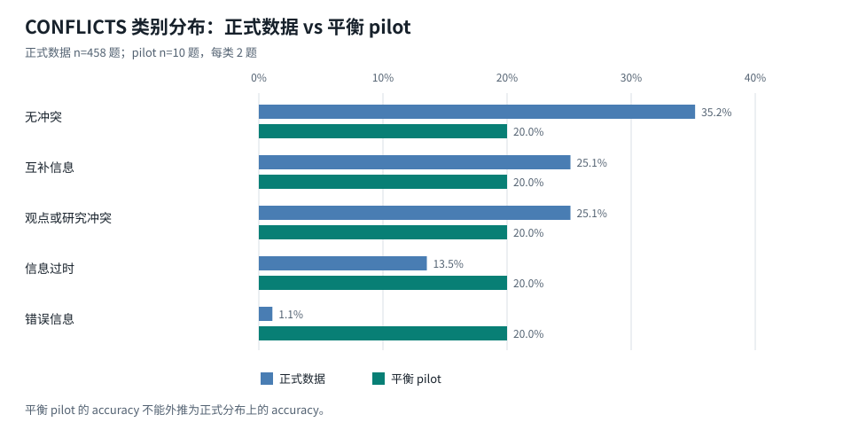
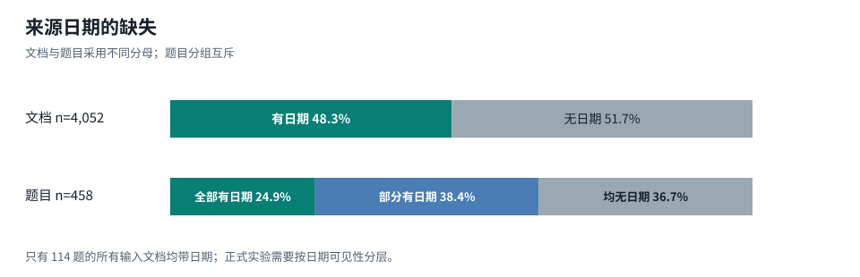
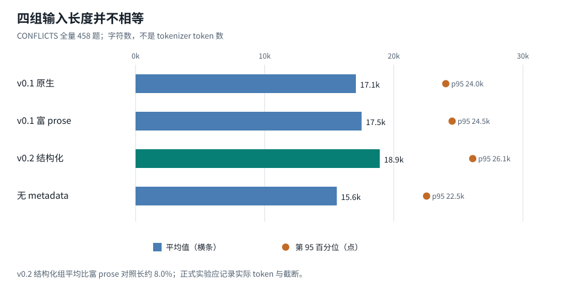
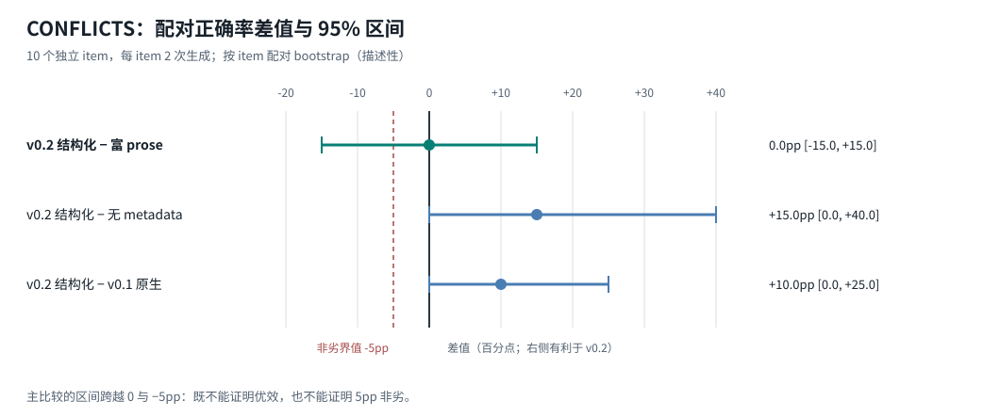
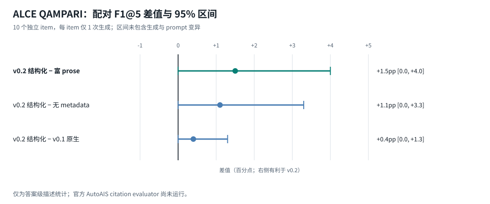

# OKF v0.2 科研评估与实验重构

## 摘要

> **2026-09-13 中期更新：**预注册 CONFLICTS 运行完成 223 / 458 个配对后暂停。P 与 S 的
> accuracy 均为 60.1%，配对差值为 0.0pp，描述性 95% 区间为 [−3.6pp, +3.6pp]；由于完整性
> 条件未满足且原始 JSONL 随临时 worktree 被清理，正式判定为 `INCOMPLETE`。详见
> [中期实验报告](./okf-v0.2-interim-results.md)。

Open Knowledge Format（OKF）v0.2 是一个以 Markdown、YAML frontmatter、目录层级和普通链接为
载体的知识交换格式。相对 v0.1，它把来源、生成者、验证事件、生命周期、新鲜度和可证明计算提升为
标准字段。官方规范能够直接支持“这些字段存在且具有规定语义”这一事实；它不能直接支持“采用这些
字段会提高大模型正确率”这一经验命题。两类主张必须分开评价。[^1]

现有 CoWiki 实验已经完成了公开数据固定、四组表示适配、真实模型调用、原始记录保留和 item-level
配对分析，是有效的工程与可行性 pilot。但严格复核后，当前实验还不能作为 OKF v0.2 的效果验证：

1. CONFLICTS 适配器没有写入 `verified`、`status` 或 `stale_after`，实际检验的是来源日期和
   provenance 的表示方式，而不是完整 trust/lifecycle 机制；
2. `v2_native - v2_ablated` 同时改变了信息是否可见，测到的是信息增量，不是纯格式效应；
3. 真正隔离编码方式的 `v2_native - v1_rich` 在 10 个独立 item 上为 `0pp`，95% bootstrap CI
   `[-15pp, +15pp]`；该区间既不能证明优效，也不能证明 5pp 界值内的非劣；
4. ALCE pilot 只有 10 个 item、单次生成，且尚未运行官方 AutoAIS citation evaluator，因此
   `+1.5pp F1@5` 只能视为答案级描述统计，不能视为引用质量提升；
5. 平衡抽样改变了 CONFLICTS 的类别分布，pilot accuracy 不能当作官方总体 accuracy；
6. 单模型、单 prompt 模板、公开题库潜在污染和 17.5% 重复预测分歧限制了外部效度。

因此，当前最严谨的结论是：**OKF v0.2 的工程与治理价值有明确的规范依据，CoWiki 可以继续实现
双读和受控试写；现有行为实验尚未证明结构化 OKF 表达优于语义等价 prose，也没有验证完整
trust/lifecycle 或稳定引用在真实编辑过程中的效益。**

建议将采用决策拆成两个 gate：

- **工程采用 gate**：解析、无损 round-trip、迁移、身份签发、生命周期策略和 Git 回滚全部通过
  确定性测试后，可进入 v0.2 opt-in；
- **效果声明 gate**：完成预注册的公开数据实验、官方 evaluator、至少两个模型家族的独立复现，
  才能声明模型质量改善。工程采用不必等待效果声明，但不得把两者混写。

## 1. 研究对象与证据边界

### 1.1 被评估的对象

OKF 是数据表示规范，不是模型、检索器、数据库、权限系统或事实核验服务。官方仓库明确把格式本身
定义为贡献核心，参考 Agent 和可视化器只是示例 consumer/producer。[^2] 因此“OKF 是否有效”不是
一个单一问题，至少包含五段因果链：

1. 规范能否表达目标事实；
2. producer 能否正确写入；
3. consumer 能否无损读取并执行一致策略；
4. Agent 或人是否会利用这些信号；
5. 最终任务是否更正确、更安全或成本更低。

前四段任意一段失败，都可能让端到端效果消失。反过来，端到端结果改善也可能来自 prompt、更长
上下文、检索器或额外信息，而不是格式本身。本报告因此不使用单一总分。

### 1.2 研究问题

| 编号 | 研究问题 | 证据类型 | 当前状态 |
| --- | --- | --- | --- |
| RQ0 | CoWiki 能否正确读取、保留、写入和迁移 v0.2？ | 确定性 conformance | 尚未实现 v0.2 writer |
| RQ1 | 在信息语义完全相同的条件下，结构化字段是否优于 prose？ | 随机化配对实验 | pilot 无差异，区间过宽 |
| RQ2 | v0.2 新增的 lifecycle/trust 信息是否改善决策？ | 信息增量实验 | 合成回归有信号；无外部验证 |
| RQ3 | stable source ID 是否降低编辑后的静默错引？ | 变形/突变测试 | 静态映射已通过；编辑不变量未测 |
| RQ4 | v0.2 是否提高端到端检索、回答和编辑质量？ | CoWiki 产品实验 | 未开始 |
| RQ5 | Attested Computation 是否提高执行可审计性？ | 安全与执行实验 | 规范不完整；不应执行 |

### 1.3 证据等级

| 等级 | 定义 | 可支持的主张 |
| --- | --- | --- |
| A | 官方规范、锁定源码、确定性测试，结果可机械复现 | 字段语义、解析与迁移正确性 |
| B | 预注册公开数据、有效 evaluator、配对统计、多模型复现 | 任务层效果与边界 |
| C | 小样本 pilot、单模型、部分 evaluator | 发现 bug、估计方差、生成假设 |
| D | 合成 fixture、演示、社区个案 | 回归测试与可行性，不作总体推断 |

当前 OKF 字段定义属于 A；本仓库确定性 harness 属于 A/C；CONFLICTS 与 ALCE 真实模型结果属于 C；
合成 lifecycle 结果属于 D。现阶段没有 B 级证据。

## 2. OKF v0.2 的规范事实与成熟度

### 2.1 已确定的规范能力

锁定 commit `ad30107` 的 v0.2 规范定义了以下关键机制：

- `sources[]` 记录来源，`sources[].id` 与 Markdown 脚注标签形成稳定 join key；
- `generated` 区分内容生产者和时间；
- `verified[]` 记录验证事件，并派生 unverified、machine-confirmed、human-reviewed 三档信任层级；
- `status` 表达 draft、stable、deprecated；
- `stale_after` 表达绝对失效时点；
- `Attested Computation` 描述 runtime、parameters、computation、executor 和 attester；
- consumer 不能因为缺少可选字段而拒绝 concept，trust tier 是 advisory signal，不是访问控制。[^1]

v0.2 保持“只有 `type` 必填”的低门槛，但 `timestamp → generated.at` 与正文 `# Citations →
sources` 是官方明确承认的 breaking changes。它们有 fallback 读取规则，却仍需要显式迁移。[^1]

### 2.2 成熟度快照

截至 2026-09-12，独立官方仓库页面显示约 410 stars、30 forks、9 个 open issues、3 个 open PR；
commit history 只有 6 个 commit，最后一次规范提交发生在 2026-08-21，且页面没有正式 release。
这些数字说明关注度快速增长，但不能证明生产采用或兼容稳定性。[^2][^3]

开放问题直接触及长期知识系统的语义边界：

- 尚无官方 JSON Schema；[^4]
- 删除后的 concept 与从未存在的 concept 无法由当前 bundle 状态区分；[^5]
- `verified` 无法表达“检查后确认错误”，社区提出 `refuted`；[^6]
- viewer 的 bundle-relative 与 file-relative link 解析仍需统一；[^7]
- 跨 bundle 导入可能复制、丢失或伪造上游 verification，社区提出只报告、不继承的 `imported`；[^8]
- relationship 仍是正文中的无类型链接，无法携带方向、生成者和验证事件。[^9]

这些不是否定 OKF 的理由，而是采用策略的约束：CoWiki 应锁定规范 commit、保留未知字段、避免将
advisory trust 当授权、并把删除、反证、跨 Space 导入和关系可信度保留在产品策略层，直到上游语义
稳定。

## 3. 理论机制：OKF 可能在哪里产生价值

### 3.1 信息容量效应

v0.1 没有统一字段表达“废弃”“何时过期”“谁验证过”。当正文也没有这些事实时，v0.2 可以向
consumer 提供原本不存在的信息。这个效应回答的是“新增语义是否有用”，而不是“YAML 是否比 prose
更适合模型”。

可检验对照为：相同正文下，提供和不提供真实、经过审计的 lifecycle/trust 事实。关键前提是元数据
不能由测试答案反向生成，否则等于把 gold label 泄漏给模型。

### 3.2 编码方式效应

当 lifecycle/trust 事实在两组都存在，只改变它位于结构化 frontmatter 还是自然语言正文时，差值才
能归因于表示方式。这是 `structured-only − prose-only` 的 estimand。若差值接近零，OKF 仍可能因
查询、索引、校验和 UI 展示而有工程价值，但不能声称提高了模型推理能力。

已有研究表明，来源时间、站点身份和页面呈现会影响模型在冲突证据中的选择，因此 metadata 不是
中性包装；输入长度、位置和视觉/文本线索都需要作为潜在混杂控制。[^20]

### 3.3 稳定身份效应

`sources[].id` 的主要理论优势不是让一次静态问答更准确，而是在来源列表重排、插入、删除和 Agent
重写后保持 claim-source 连接。官方规范也以“位置索引会在重排后静默错引”解释 stable ID。[^1]

因此最直接的验证不是 ALCE 单轮答案 F1，而是 metamorphic test：对同一文档执行无语义变化的来源
重排和插入，断言每条 claim 仍解析到同一 source；删除被引用 source 时必须显式报错，不能自动改指
其他位置。

### 3.4 治理效应

`verified` 的价值取决于 actor 身份和签发路径。如果 Agent 能自行写入 `human:*`，格式反而制造
虚假权威。跨 bundle 复制 verification 也可能形成 trust laundering，这正是上游 `imported` 提案
指出的问题。[^8] 因此 trust 的效果实验必须把“内容正确性”和“行为授权”分开；human-reviewed 只
表示发生过某次人工确认，不等价于事实永真，也不等价于允许执行动作。

## 4. 现有 CONFLICTS 实验复核

### 4.1 Benchmark 与数据分布

CONFLICTS 由真实搜索结果构建，提供专家协调的五类冲突标签，适合评价模型是否识别 no conflict、
互补、研究意见冲突、过时信息和 misinformation。论文报告模型在冲突识别和适当响应上仍有明显改进
空间。[^10] 当前 harness 固定官方数据仓库 commit 和文件 SHA-256，保留问题、搜索结果、日期、标签
和 gold answer。[^11]

对锁定的 458 题本地审计得到：

| 标签 | 题数 | 官方数据占比 | 10 题平衡 pilot 占比 |
| --- | ---: | ---: | ---: |
| No conflict | 161 | 35.2% | 20% |
| Complementary information | 115 | 25.1% | 20% |
| Conflicting opinions and research outcomes | 115 | 25.1% | 20% |
| Conflict due to outdated information | 62 | 13.5% | 20% |
| Conflict due to misinformation | 5 | 1.1% | 20% |

*图 1｜正式数据（n=458）与 pilot（n=10）的标签构成。pilot 每类固定抽 2 题，不按总体权重抽样；横轴为各自样本内占比。数据：锁定的 CONFLICTS 审计与平衡 pilot 选择记录。*

458 题共包含 4,052 篇进入适配器的文档，平均每题 8.85 篇。只有 1,959 篇文档带日期，覆盖率
48.3%；290 题至少有一篇带日期，只有 114 题的全部输入文档都有日期。日期缺失不是随机噪声，可能
随来源子集和冲突类别变化，正式分析必须报告 missingness 并做带日期/无日期分层。

*图 2｜来源日期缺失情况。第一行以文档为分母（n=4,052），第二行以题目为分母（n=458）；“全部/部分/均无日期”是互斥题目组。数据：锁定的 CONFLICTS 审计。*

平衡 pilot 适合验证每类都能跑通和观察错误类型，但它把 misinformation 从 1.1% 提高到 20%。因此
pilot 的 45% accuracy 既不是官方自然分布 accuracy，也不是可直接外推的总体性能。

### 4.2 Arm 实际操纵内容

代码审计显示四组并非只改变“版本号”：

| Arm | 可见日期/来源信息 | 实际含义 |
| --- | --- | --- |
| `v1_native` | source date 写为文档 `timestamp`；正文编号 citation | v0.1 原生时间线索 |
| `v1_rich` | `timestamp` 加 prose source ID、URL、publication date | 相同事实的富 prose，但日期有重复 |
| `v2_native` | 固定 `generated.at`；source date 写为 `sources[].last_modified`；stable ID | v0.2 provenance 表示 |
| `v2_ablated` | 不显示上述时间与来源 metadata | 信息缺失对照 |

适配协议明确禁止从 benchmark 推断 `verified`、`status`、authority、freshness 或 correctness。
因此该轨道没有检验 v0.2 trust tier、deprecated 或 `stale_after`。`v2_native - v2_ablated` 是“有
来源日期等信息”减“没有这些信息”，不能解释为纯格式效果。

全量 prompt 字符数审计还发现表示成本不等：

| Arm | 平均字符数 | p50 | p95 |
| --- | ---: | ---: | ---: |
| `v1_native` | 17,064 | 16,692 | 24,026 |
| `v1_rich` | 17,508 | 17,171 | 24,518 |
| `v2_native` | 18,916 | 18,622 | 26,114 |
| `v2_ablated` | 15,588 | 15,277 | 22,540 |

*图 3｜四组在全量 458 题上的 prompt 长度。横条是平均字符数，圆点是第 95 百分位，不是置信区间；字符数也不等于模型实际计费 token。数据：锁定的 CONFLICTS 审计。*

`v2_native` 比公平 prose 对照平均长约 8.0%，比消融组长约 21.4%。这既是需要报告的产品成本，也
可能通过注意力分配产生效果。正式 runner 应记录真实 tokenizer 的 input/output tokens、截断状态和
上下文上限，而不只记录字符数。

### 4.3 结果的正确解释

10 个 item、2 次重复、4 arms、单模型的结果为：

| Arm | Trials | Accuracy | Macro-F1 |
| --- | ---: | ---: | ---: |
| `v1_native` | 20 | 35.0% | 34.9% |
| `v1_rich` | 20 | 45.0% | 46.7% |
| `v2_native` | 20 | 45.0% | 45.1% |
| `v2_ablated` | 20 | 30.0% | 30.0% |

统计单位是 10 个 item，不是 80 次调用。repetition 是 item 内重复测量，不能当作新增独立样本。
按 item 先平均 repetition 后：

- `v2_native - v1_rich = 0pp`，95% bootstrap CI `[-15pp, +15pp]`；
- `v2_native - v2_ablated = +15pp`，CI `[0pp, +40pp]`；
- `v2_native - v1_native = +10pp`，CI `[0pp, +25pp]`。

*图 4｜配对正确率差值及描述性 95% bootstrap 区间；独立单位是 10 个 item，而非 80 次调用。红色虚线是假设的 −5pp 非劣界值，尚未经过正式预注册；右移表示 v0.2 结构化组点估计更高。数据：平衡 pilot 报告。*

配对评价优于分别比较两组平均值，因为同一题上的结果相关；NLP 研究也表明忽略 instance-level pairing
可能改变系统排序结论。[^15] 但 n=10 的 percentile bootstrap 只有很少的独立支持点，区间端点不
稳定。当前三组 comparison 也没有预先指定唯一 primary contrast 或多重比较控制。

最关键的是研究问题与统计假设必须一致：

- 若主张“v0.2 更好”，需要 superiority test；当前 `0pp` 不支持；
- 若主张“v0.2 不比等价 prose 差”，需要先定义 non-inferiority margin；若 margin 为 5pp，当前
  lower bound `-15pp` 不支持；
- 若主张“两种表示等效”，需要 equivalence test，且整个置信区间落在预设 `[-δ,+δ]` 内；当前
  也不支持。

因此不能从“点估计相同”推出“等效”，也不能从消融差值推出“结构化格式更好”。报告差值和区间、
而不是只看显著性，是更适合当前阶段的呈现方式。[^16][^17]

### 4.4 其他效度威胁

- **模型随机性**：40 个重复 item/arm 对中 7 对预测不同，分歧率 17.5%。
- **Prompt 敏感性**：只使用一个 instruction template；相关研究表明语义近似模板也可能产生可观
  方差，可靠评测需要覆盖 prompt 变体。[^19]
- **模型范围**：只完成一个模型，不能推断跨 provider 或跨规模一致性。
- **数据污染**：CONFLICTS 自 2025 年公开，闭源模型训练集不可审计。污染可能抬高绝对分数；配对
  设计能削弱但不能完全消除差异污染。[^18]
- **固定生成时间**：`v2_native` 写入一个与 item 无关的固定 `generated.at`，这是 v1 组没有的
  时间锚点，应移除或从同一 canonical record 为各组生成语义等价信息。
- **Gold 与输入的边界**：若未来依据官方 conflict label 生成 `status/deprecated`，就会把目标答案
  编入输入，只能测试 policy compliance，不能测试自主冲突判断。

### 4.5 CONFLICTS 能支持的结论

当前结果支持：公开数据适配和确定性五分类 grader 已跑通；同一 item/repetition 的文档顺序跨 arm
一致；模型确实会利用可见的来源时间信息；结构化表示在该小样本上没有明显胜过语义相近 prose。

当前结果不支持：v0.2 trust/lifecycle 有效、v0.2 优于 v0.1、v0.2 与 prose 等效、总体准确率提高
10–15pp、或效果可以跨模型复现。

## 5. 现有 ALCE 实验复核

### 5.1 Benchmark 与 evaluator

ALCE 专门评价带引用生成，包含 citation correctness 与 completeness，并提供 QAMPARI 等任务和
官方 evaluator。[^12] 当前数据锁定到 1,000 题、每题 5 篇 reranked-oracle 文档的 QAMPARI 文件；
本地 `precision/recall/Recall@5/F1/F1@5` 实现逐项复现官方 `compute_qampari_f1` 公式。官方 citation
recall/precision 则调用 `google/t5_xxl_true_nli_mixture` AutoAIS，对每个输出片段与所引文档做
NLI 判断。[^13]

这意味着答案级指标可确定性复现，但 citation 指标本身仍依赖一个大型模型 evaluator。使用官方
evaluator 有利于与 ALCE 对齐，却不能把其判定当作绝对真值；正式报告应增加人工抽检和 evaluator
版本信息。

### 5.2 Pilot 结果

固定 SHA 抽取 10 题、4 arms、单模型、每题一次：

| Arm | Precision | Recall | Recall@5 | F1 | F1@5 |
| --- | ---: | ---: | ---: | ---: | ---: |
| `v1_native` | 49.0% | 32.9% | 50.0% | 34.1% | 46.8% |
| `v1_rich` | 49.0% | 30.2% | 48.0% | 31.6% | 45.7% |
| `v2_native` | 49.8% | 29.7% | 50.0% | 31.3% | 47.3% |
| `v2_ablated` | 49.8% | 29.0% | 48.0% | 30.5% | 46.2% |

`v2_native - v1_rich` 的配对 F1@5 为 `+1.5pp`，描述性 bootstrap CI `[0,+4.0pp]`。n=10、无
generation repetition、无 prompt 变体时，这个区间只反映固定样本上的 item 差异，没有包含模型
重复生成与模板选择的不确定性，不能用于正式显著性结论。

*图 5｜QAMPARI 答案级 F1@5 差值。n=10、每题单次生成；区间不含生成和 prompt 变异，也不是官方 citation 指标。数据：ALCE pilot preflight 报告。*

### 5.3 引用实验尚未回答的问题

所有 v0.2 stable ID 都能转换到当前文档顺序中的 `[N]`，说明 adapter mapping 没有未解析 ID。
但在传给 ALCE evaluator 前，stable ID 已被转换成位置引用；因此 evaluator 只能评价“模型所选文档
是否支持回答”，不能评价 stable ID 在后续编辑中是否比位置引用稳定。

此外，官方 AutoAIS 尚未在当前机器执行成功，所以当前没有 citation recall 或 precision。报告不能把
“未解析 ID 为 0”写成“引用正确率为 100%”：前者是句法映射完整性，后者是语义支持度。

复核期间还发现导出文件原先写成裸数组，而锁定的官方 `eval.py` 要求顶层对象包含 `data`。该实现已
修正为 `{ "data": [...] }`，四个 arm 已重新导出并增加结构测试；这也说明只有真正执行官方 evaluator
才能验证所谓“兼容导出”。

## 6. 更严谨的实验设计

> **实施状态（2026-09-13）**：本节的 N/P/S/PS 设计已经落入 external adapter；CONFLICTS 的
> `S−P` 主比较已在正式运行前冻结为
> [`PREREGISTRATION.md`](../benchmarks/okf-delta/PREREGISTRATION.md)。runner 的 `--formal`
> 模式会强制校验完整 458 题、两个主实验组、模型、重复数、seed 和锁定数据，并把预注册文件摘要
> 写入每条结果。正式 916 次调用尚未执行，因此本报告仍没有确认性结果。

### 6.1 预注册的 primary claims

正式运行前必须冻结以下主张，不能在看完结果后选择最有利的一个：

1. **编码非劣性**：在信息语义相同的条件下，structured-only 相对 prose-only 的正确率下降不超过
   预设 margin `δ`；
2. **信息增量优效性**：在确实需要 lifecycle/trust 的题上，structured-only 相对 no-metadata 的
   unsafe error rate 至少下降预设幅度；
3. **稳定引用不变量**：无语义来源重排、插入或删除后，stable-ID 的静默错引率为 0；
4. **迁移安全**：v0.1→v0.2 迁移的非目标语义变化和失败后残留均为 0。

每个 track 只设置一个 primary outcome。其他 accuracy、macro-F1、拒答、成本和分层结果均为
secondary 或 diagnostic，并使用 Holm 校正或明确标记 exploratory。

### 6.2 表示实验的四组

从一个 canonical intermediate record 机械生成四组，确保事实逐字段一致：

| Arm | Lifecycle/trust 事实 | 编码位置 | 作用 |
| --- | --- | --- | --- |
| N | 无 | 无 | 信息缺失基线 |
| P | 有 | 仅 prose | 公平自然语言通道 |
| S | 有 | 仅 v0.2 frontmatter | 纯结构化通道 |
| PS | 有 | prose + v0.2 | 真实部署形态 |

主要 estimands：`S−P` 是编码方式效应；`S−N` 和 `P−N` 是信息可见性效应；`PS−N` 是部署总效应。
原生 v0.1 可作为 migration baseline，但不应代替上述因果对照。

所有 arm 必须满足：正文证据、文件名、文档顺序、问题、输出 schema、模型参数、上下文上限相同；
不同 arm 的文档顺序在同一 item/repetition/template 上完全一致；不得根据结果修改题目或解释字段。
真实 input tokens 和是否截断作为必报指标。

### 6.3 Metadata ground truth

公开 benchmark 通常没有 OKF-native `verified/status/stale_after`。不得用模型要预测的 label 自动生成
这些字段。可接受的来源只有：

1. 原始数据已经提供的可验证事实，例如 URL、publication date、明确 source identity；
2. 与目标标签独立的外部事实，例如官方页面的有效期或正式废弃声明；
3. 运行前由两名标注者独立标注、第三人裁决的 metadata extension。

标注者必须看不到模型输出和 arm 表现。报告 label guideline、冲突率、adjudication 数量，以及
Krippendorff's alpha 或适合该字段类型的一致性统计。metadata correctness 与模型 outcome 分开抽检。

### 6.4 数据集组合

不存在能独立覆盖 OKF 全部构念的公开 benchmark，应使用 suite：

| 构念 | 推荐来源 | 用法 | 局限 |
| --- | --- | --- | --- |
| 冲突类型/过时信息 | CONFLICTS | 公开问题、文档、日期、五分类 label | 日期覆盖不完整；无 verified/status truth |
| Citation 支持度 | ALCE QAMPARI | 官方答案指标和 AutoAIS citation evaluator | evaluator 昂贵且模型化；数据许可未声明 |
| Source authority | AuthorityBench RAGAuth | 120 个 varying-authority RAG 问题；MIT 代码 | 仓库和论文很新；需先复现原结果[^21] |
| Authority preservation | AuthMem-Bench | 写入时 authority collapse 与下游未授权行为 | 2026-08 新预印本；当前页面未给出可调用代码[^22] |
| Metadata 因果效应 | RAG metadata study | publication time/source/appearance 的受控操纵 | 不是 OKF；适合作为设计参照[^20] |
| Stable-ID 编辑安全 | OKF metamorphic corpus | 重排、插入、删除、跨 bundle 导入 | 必须自建，但结果是确定性不变量而非主观题库 |

自建 corpus 只承担公开 benchmark 无法表达的协议不变量，并且应从明确的转换规则生成，不承担模型
效果 headline。这样既避免“完全自己出题”，也避免强行把不匹配的公开数据包装成 OKF 证据。

### 6.5 随机化、重复与盲法

- item 在模型调用前按公开 seed 固定；正式集不能在看过 pilot 结果后删题；
- 每个 item 的 arm 顺序随机化，文档顺序在 arm 间配对一致；
- 至少准备 3 个语义等价、人工审核的 task instruction template，template 作为重复测量维度；
- 模型不支持固定 decoding seed 时，每个 item/arm/template 至少重复 2 次；
- grader 在不知道 arm 名称的情况下处理输出；确定性 label grader 优先于 LLM judge；
- 两个模型家族分别形成 replication，不能把模型当额外独立 item 混合提高显著性。

HELM 强调统一场景、多指标和发布原始 prompt/completion；当前研究也应保留完整调用记录、失败、
模型标识和所有分析选择。[^14]

### 6.6 统计分析计划

#### 二分类 primary outcome

以 item 为 cluster。先对同一 item 下的 repetition/template 求平均，再计算 arm 间配对差值。报告：

- 绝对百分点差；
- item-cluster bootstrap 95% CI；
- 配对 permutation p-value；
- binary 单次设计的 discordant pair 表与 McNemar sensitivity analysis；
- 拒答、invalid 和失败均保留在分母，另做 failure-policy sensitivity analysis。

如果目标是 non-inferiority，应使用单侧检验和预先确定的 `δ`。`δ` 必须由产品风险确定，例如“错误
选择过期知识最多允许增加多少”，不能由 pilot 效果反推。

#### 多分类 outcome

accuracy 作为自然分布 primary；macro-F1、逐类 recall 和 confusion matrix 作为 secondary。
若使用分层过采样，必须按官方类别概率加权恢复总体 accuracy，并同时报告未加权分层结果。只有 5 个
misinformation item 时，不能对该类给出稳定总体推断。

#### 连续指标

ALCE item-level F1@5、token、latency 使用配对 cluster bootstrap。latency 通常右偏，同时报告 median、
p95 和配对 log-ratio。成本比较必须以质量不低于预设 margin 为前提，不能用少输出换取表面低成本。

#### 不确定性来源

正式区间至少包含 item sampling；若主张对 prompt 和 decoding 稳健，还应通过两阶段 bootstrap 或
分层模型包含 template/repetition 方差。只对固定输出重采样 item 会低估完整 replication uncertainty。

### 6.7 样本量

现有 10-item pilot 中，`v2_native` 与 `v1_rich` 的逐次 discordance 为 10%，但小样本估计极不稳定。
此前“155 item、620 calls”来自假设 20% discordance、希望发现 `+10pp` superiority 的 McNemar
近似；它不适用于证明 5pp non-inferiority。

若真实差值为 0、discordance 为 10–20%，使用单侧 `alpha=0.025`、power 80%、non-inferiority
margin 5pp，粗略需要约 314–628 个独立 item 对。CONFLICTS 全量只有 458 题，因此在保守方差下甚至
可能不足以证明 5pp 非劣。正式预算必须先选 claim 和 margin，再计算样本量，不能先定 400/620 次
调用再寻找能通过的统计问题。

建议顺序：先全量跑两个 primary arms、一个 template、一次生成以获得 458 个 item 对（916 calls）；
再基于不看 arm outcome 的 blinded variance estimate 决定是否增加 template/repetition。第二模型作为
独立 replication。若资源不足，应放宽主张或 margin，而不是把独立样本数与 repetition 混为一谈。

## 7. CoWiki 的确定性工程验证

行为 benchmark 不能替代格式正确性。CoWiki 当前把 `OKF_VERSION` 固定为 `0.1`，对声明为其他版本的
Space 可以 best-effort 读取，但通过 `ensure_supported_for_write` 拒绝写入；因此目前不是 v0.2 writer。
这一状态适合开始 consumer 实现，却不能声称已采用 v0.2。[^23]

### 7.1 必须 100% 通过的属性

- v0.1/v0.2 合法 frontmatter 解析；
- bare mapping 与 list 两种 `verified` 形态归一化；
- 所有时间字段要求 ISO 8601 datetime 与显式 UTC offset；
- unknown type/key、YAML scalar、Unicode、正文、注释在非目标编辑中保持；
- `timestamp` 和 `# Citations` fallback；
- v0.1→v0.2 迁移检测同名扩展字段冲突，尤其是 `status`；
- stable source ID 在 reorder/insert 后保持解析对象不变；
- 删除被引 source、重复 ID、悬空脚注必须显式失败；
- Agent 不能签发 `human:*` verification；
- 迁移失败后 HEAD、index、工作树和本地状态完全恢复；
- Attested Computation 默认只读，任何 executor/attester 都不因文件声明自动获权。

### 7.2 Metamorphic test 矩阵

| 原始输入变换 | 应保持的不变量 | 失败条件 |
| --- | --- | --- |
| 重排 `sources[]` | 每条脚注仍解析到同一 source ID | 引用改指其他来源 |
| 在列表头插入 source | 旧 claim-source 关系不变 | 位置偏移导致错引 |
| 移动 concept 文件 | 明确的相对链接策略可预测 | 静默断链或错误目标 |
| 更新正文但不复核 | 旧 verification 不应被 UI 暗示为新内容验证 | trust laundering |
| 导入其他 bundle | 上游 verification 不自动成为本地 verification | 身份继承失真 |
| 删除 concept | 依产品策略保留 tombstone/审计 | 与 never existed 无法区分 |
| YAML parser round-trip | 非目标语义与正文保持 | 时间类型、引号或未知字段变化 |

这些测试直接命中 stable ID、迁移和治理价值，比让 LLM 回答静态题更接近 OKF 的核心贡献。

## 8. 采用决策

### 8.1 当前可以做的决定

建议继续 **双读、受控试写、显式迁移**：

1. 固定 `ad30107`，先实现 v0.2 consumer 与 UI 展示；
2. 新 Space 允许 opt-in v0.2 writer，旧 Space 不自动改写；
3. verification 只能由可信 UI/服务签发，Agent 只可写自身 `generated.by`；
4. `deprecated/stale_after` 进入检索策略，但必须显示原因和来源，不把 advisory signal 当 ACL；
5. 暂不执行 Attested Computation；
6. 所有迁移使用独立 Git commit、预览、幂等与回滚。

这个决定依据的是格式契合度、Git 可审阅性和可确定性验证的工程收益，不依赖尚未成立的模型准确率
提升主张。

### 8.2 当前不能做的声明

- “v0.2 比 v0.1 准确率提高 10%/15%”；
- “结构化字段优于等价 prose”；
- “stable source ID 已提高引用正确率”；
- “trust tier 能可靠代表事实可信度”；
- “ALCE 官方 citation score 已复现”；
- “结果跨模型、跨任务或跨真实 CoWiki workflow 成立”。

### 8.3 重新评审条件

满足以下条件后，才能形成 B 级效果结论：

- 预注册文件已提交且早于正式模型输出；
- canonical metadata 生成与四 arm 等价性测试通过；
- primary outcome、margin、样本量、失败策略和多重比较规则冻结；
- CONFLICTS 全量或有统计依据的固定样本完成；
- ALCE official evaluator 在锁定环境复现，且人工抽检 evaluator；
- 至少两个模型家族分别报告；
- 所有 prompts、outputs、errors、hashes、代码 revision 和环境清单可审计；
- 确定性 migration/metamorphic suite 100% 通过。

## 9. 结论

OKF v0.2 最可信的价值主张不是“YAML 让模型更聪明”，而是：它为不断被人和 Agent 重写的知识提供
一组跨工具可查询、可 diff、可审计的 provenance、verification 和 lifecycle 信号。该机制在理论上
解决了 v0.1 的表达空缺，也与 CoWiki 的本地优先和 Git Review 架构一致。

当前实验证明了 harness 能工作，并暴露了模型随机性、顺序混杂、官方 evaluator 环境和导出格式等
真实问题；这正是 pilot 的科学价值。但它没有直接测试完整 trust/lifecycle，也没有足够样本证明
structured encoding 的非劣或优效。最合理的研究路线是把公开 benchmark 用于其真正有 gold 的构念，
把 OKF 独有的迁移与 stable-ID 属性转为确定性不变量测试，再通过预注册、配对设计、官方 evaluator
和跨模型复现逐层建立证据。

## Sources

[^1]: Google Cloud Platform. “[Open Knowledge Format v0.2 Specification, commit ad30107](https://github.com/GoogleCloudPlatform/open-knowledge-format/blob/ad30107/SPEC.md?plain=1).” 2026-08-21.
[^2]: Google Cloud Platform. “[Open Knowledge Format repository](https://github.com/GoogleCloudPlatform/open-knowledge-format).” Accessed 2026-09-12.
[^3]: Google Cloud Platform. “[open-knowledge-format commit history](https://github.com/GoogleCloudPlatform/open-knowledge-format/commits/main).” Accessed 2026-09-12.
[^4]: Google Cloud Platform. “[JSON Schema for the OKF YAML MD Frontmatter, issue #8](https://github.com/GoogleCloudPlatform/open-knowledge-format/issues/8).” Accessed 2026-09-12.
[^5]: Google Cloud Platform. “[Deletion semantics, issue #11](https://github.com/GoogleCloudPlatform/open-knowledge-format/issues/11).” 2026-08-27.
[^6]: Google Cloud Platform. “[Proposal: Third trust field `refuted`, issue #13](https://github.com/GoogleCloudPlatform/open-knowledge-format/issues/13).” 2026-08-29.
[^7]: Google Cloud Platform. “[Viewer link resolution, issue #14](https://github.com/GoogleCloudPlatform/open-knowledge-format/issues/14).” 2026-08-31.
[^8]: Google Cloud Platform. “[Proposal: `imported`, issue #15](https://github.com/GoogleCloudPlatform/open-knowledge-format/issues/15).” 2026-09-01.
[^9]: Google Cloud Platform. “[Proposal: typed, directed, trust-bearing relationships, issue #16](https://github.com/GoogleCloudPlatform/open-knowledge-format/issues/16).” 2026-09-01.
[^10]: Cattan et al. “[DRAGged into Conflicts: Detecting and Addressing Conflicting Sources in Search-Augmented LLMs](https://arxiv.org/abs/2506.08500).” 2025.
[^11]: Google Research Datasets. “[RAG CONFLICTS dataset](https://github.com/google-research-datasets/rag_conflicts).” Dataset revision locked locally to `81ba921dd684a93db41a7e9dda6b6a7c67348a88`.
[^12]: Gao et al. “[Enabling Large Language Models to Generate Text with Citations](https://arxiv.org/abs/2305.14627).” 2023.
[^13]: Princeton NLP. “[ALCE `eval.py`, commit 246c476](https://github.com/princeton-nlp/ALCE/blob/246c476a4edfc564266b7346b6e29ef4861ae937/eval.py).” Accessed 2026-09-12.
[^14]: Liang et al. “[Holistic Evaluation of Language Models](https://arxiv.org/abs/2211.09110).” 2022.
[^15]: Peyrard et al. “[Better than Average: Paired Evaluation of NLP Systems](https://aclanthology.org/2021.acl-long.179/).” ACL-IJCNLP 2021.
[^16]: Dror et al. “[The Hitchhiker's Guide to Testing Statistical Significance in Natural Language Processing](https://aclanthology.org/P18-1128/).” ACL 2018.
[^17]: Bestgen. “[Please, Don't Forget the Difference and the Confidence Interval when Seeking for the State-of-the-Art Status](https://aclanthology.org/2022.lrec-1.640/).” LREC 2022.
[^18]: Sainz et al. “[NLP Evaluation in Trouble: On the Need to Measure LLM Data Contamination for Each Benchmark](https://arxiv.org/abs/2310.18018).” 2023.
[^19]: Lior et al. “[ReliableEval: A Recipe for Stochastic LLM Evaluation via Method of Moments](https://aclanthology.org/2025.findings-emnlp.594/).” Findings of EMNLP 2025.
[^20]: Chiang and Lee. “[Do Metadata and Appearance of the Retrieved Webpages Affect LLM's Reasoning in Retrieval-Augmented Generation?](https://aclanthology.org/2024.blackboxnlp-1.24/).” BlackboxNLP 2024.
[^21]: Yao, Zhang, and Bi. “[AuthorityBench: Benchmarking LLM Authority Perception for Reliable Retrieval-Augmented Generation](https://arxiv.org/abs/2603.25092).” 2026; [official repository](https://github.com/Trustworthy-Information-Access/AuthorityBench).
[^22]: Zhan et al. “[When Memory Becomes Authority: Benchmarking Authority Collapse at the Memory Consolidation Boundary](https://arxiv.org/abs/2608.01679).” arXiv v2, 2026-08-04.
[^23]: CoWiki repository evidence. [`web/src-tauri/src/okf.rs`](../web/src-tauri/src/okf.rs) and [`web/src-tauri/src/local_engine.rs`](../web/src-tauri/src/local_engine.rs), accessed 2026-09-12.

本地实验数据、source revisions、checksums、arms 和复现命令见
[`benchmarks/okf-delta`](../benchmarks/okf-delta/README.md)、
[`sources.lock.json`](../benchmarks/okf-delta/sources.lock.json) 与
[`EXTERNAL-PROTOCOL.md`](../benchmarks/okf-delta/EXTERNAL-PROTOCOL.md)。图 1–5 可由
[`render-report-figures.mjs`](../benchmarks/okf-delta/scripts/render-report-figures.mjs) 从锁定审计与
pilot 报告重新生成；图中的置信区间均为 pilot 描述性区间，不是确认性试验结论。
